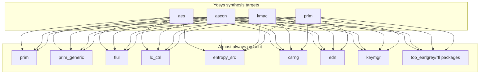

# OpenTitan IP Dependencies

This document describes the **IP-level dependencies** for the OpenTitan cryptographic and primitive blocks under `opentitan/hw/ip/`. It covers both **Yosys synthesis** and **Verilator simulation** requirements.

---

## Target Designs

| IP | Description | pre_dv Testbenches |
|----|-------------|-------------------|
| **aes** | AES-128/256 accelerator with GCM, multiple S-box implementations | `aes_tb`, `aes_sbox_tb`, `aes_cipher_core_tb`, `aes_wrap_tb` |
| **ascon** | Ascon AEAD/hash accelerator | `ascon_sim` |
| **kmac** | Keccak/SHA3/KMAC accelerator | `kmac_reduced_tb` |
| **prim** | Shared primitive library (flops, FIFOs, crypto building blocks, etc.) | `prim_trivium_tb`, `prim_crc32_sim`, `prim_sync_reqack_tb`, `prim_ascon_round_tb`, `prim_ascon_duplex_tb` |

---

## Yosys Synthesis Flow Overview

Each design uses the same general flow under `<ip>/yosys_syn/`:

1. **Filelist** (`*_yosys.f`) — include search paths (`-I`), SystemVerilog packages in compile order, then dependency RTL, then the core IP RTL.
2. **Environment** (`env.sh`) — `DESIGN_NAME`, `VERILOG_FILELIST`, ASAP7 liberty root (`ASAP7_LIB_DIR`), `VT`, `CORNER`, `ABC_AREA`, `FLATTEN`, `SDC_FILE`.
3. **`syn.tcl`** (Yosys) — parses the filelist, runs **sv2v** on SystemVerilog sources, `read_verilog` on converted Verilog, elaborates `DESIGN_NAME`, maps to ASAP7 cells via **ABC**, writes netlists under `generated/` and `syn_results/`.
4. **Supporting TCL** — `synth_util.tcl`, `synth_stdcells.tcl`, `synth_abc.tcl`, `abc_area.script` / `abc_speed.script`, `constraint.sdc`.
5. **Optional wrapper** — `run_syn.sh` drives synthesis and/or STA (`run_sta.tcl`).

### Tool and Technology Dependencies

| Item | Role |
|------|------|
| `yosys` | Synthesis driver (`syn.tcl` uses `yosys -import`). |
| `sv2v` | SystemVerilog → Verilog conversion before `read_verilog`. |
| ASAP7 NLDM liberty | Standard-cell timing/power views; default path `/workspace/techlib/asap7sc7p5t_28/LIB/NLDM` (override with `ASAP7_LIB_DIR`). |
| `ABC` | Invoked from Yosys for technology mapping (area vs. speed via `ABC_AREA`). |

---

## Shared OpenTitan IP Blocks

All four flows pull RTL from a common set of **non-local** IPs. The exact **packages** and **.sv modules** differ per filelist.



**Notes:**

- **`prim`** — Local packages always come from `prim/rtl/*_pkg.sv`. AES, ASCON, and KMAC also instantiate a **subset** of `prim/rtl/*.sv` modules listed in their filelists. The **prim** Yosys flow compiles the **entire** prim library from `prim_yosys.f` and selects the top with `DESIGN_NAME`.
- **`prim_generic`** — Technology-agnostic cells (`prim_flop`, `prim_buf`, etc.) used by mapped primitives; listed explicitly in every filelist.
- **`top_earlgrey/rtl`** — Lives under `hw/top_earlgrey/rtl`, **not** under `hw/ip/`. Filelists use `../../../top_earlgrey/rtl` from `yosys_syn/`. **ASCON** pulls mainly `top_pkg.sv`; **AES**, **KMAC**, and **prim** also include additional chip-level packages (`ibex_pmp_reset_pkg`, `jtag_id_pkg`, `prim_xilinx_pkg`, `scan_role_pkg`, etc.) as required by their richer dependency closure.
- **`tlul`** — Bus adapters and integrity modules for CSR/register blocks (fuller set for **KMAC** because of SRAM/socket paths).

---

## Supporting IPs (Not Contest Targets)

These IPs are **not** part of the contest scope but are **required** for FuseSoC dependency resolution and Verilator builds. They provide packages, bus interfaces, and glue logic.

### prim_generic

**Role:** Technology-agnostic implementations of virtual primitives (flops, clock gates, RAMs, etc.).

**Why needed:** FuseSoC resolves virtual cores like `lowrisc:prim:flop` to concrete implementations. For Verilator simulation, `prim_generic` provides RTL that does not instantiate PDK cells.

**Used by:** All target IPs (aes, ascon, kmac, prim testbenches).

---

### tlul (TileLink-UL Bus)

**Role:** OpenTitan's on-chip interconnect. Provides adapters, sockets, and register interfaces.

**Key cores:**
- `lowrisc:tlul:headers` — `tlul_pkg.sv` (bus types)
- `lowrisc:tlul:adapter_reg` — Register-mapped peripheral wrapper
- `lowrisc:tlul:socket_1n`, `socket_m1` — Bus fabric
- `lowrisc:tlul:jtag_dtm` — JTAG debug (pulls in `rv_dm`)

**Why needed:** AES, Ascon, KMAC are comportable IPs with TL-UL register interfaces. Even `pre_dv` benches may pull in TL-UL packages or adapters.

**Dependency chain:**
```
aes.core / ascon.core / kmac.core
  └── lowrisc:ip:tlul
        ├── lowrisc:tlul:adapter_reg
        ├── lowrisc:tlul:headers
        │     └── lowrisc:virtual_constants:top_pkg  (needs top_earlgrey)
        ├── lowrisc:tlul:jtag_dtm
        │     ├── lowrisc:ip:jtag_pkg  (in rv_dm)
        │     └── pulp-platform:riscv-dbg (in hw/vendor)
        └── ...
```

---

### rv_dm (RISC-V Debug Module)

**Role:** Provides `jtag_pkg.sv` (JTAG interface types).

**Why needed:** `tlul:jtag_dtm` depends on `lowrisc:ip:jtag_pkg`, which is defined in `rv_dm/jtag_pkg.core`.

**Note:** The full `rv_dm` RTL is not used by target IPs; only the package is required.

---

### lc_ctrl (Lifecycle Controller)

**Role:** Provides `lc_ctrl_pkg.sv` and `lc_ctrl_state_pkg.sv` — lifecycle state types and `lc_tx_t` signals.

**Why needed:** Several primitives (`prim_lc_sync`, `prim_lc_sender`, `prim_alert`) and IP packages use `lc_ctrl_pkg::lc_tx_t` for secure control signals.

**Dependency chain:**
```
prim_alert.core / prim_lc_sync.core
  └── lowrisc:ip:lc_ctrl_pkg
        ├── lowrisc:tlul:headers
        └── lowrisc:ip:lc_ctrl_state_pkg
```

---

### edn (Entropy Distribution Network)

**Role:** Provides `edn_pkg.sv` — types for entropy requests/responses.

**Why needed:** AES, Ascon, KMAC support entropy/masking for side-channel countermeasures. `lowrisc:ip:edn_pkg` is in the dependency chain.

**Dependency chain:**
```
kmac.core / aes.core
  └── lowrisc:ip:edn_pkg
        └── lowrisc:ip:csrng_pkg
```

---

### csrng (Cryptographic Secure RNG)

**Role:** Provides `csrng_pkg.sv` — types used by `edn_pkg`.

**Why needed:** Transitive dependency from `edn_pkg`.

**Dependency chain:**
```
edn_pkg.core
  └── lowrisc:ip:csrng_pkg
        ├── lowrisc:tlul:headers
        ├── lowrisc:ip:lc_ctrl_pkg
        └── lowrisc:ip:entropy_src_pkg
```

---

### entropy_src (Entropy Source)

**Role:** Provides `entropy_src_pkg.sv` — types for raw entropy.

**Why needed:** Transitive dependency from `csrng_pkg`.

---

### keymgr (Key Manager)

**Role:** Provides `keymgr_pkg.sv` — sideload key types.

**Why needed:** AES, Ascon, KMAC support key sideloading from the key manager. The package defines `keymgr_pkg::hw_key_req_t` used in those IPs.

**Dependency chain:**
```
aes.core / ascon.core / kmac.core
  └── lowrisc:ip:keymgr_pkg
        ├── lowrisc:virtual_constants:top_pkg
        └── lowrisc:ip:edn_pkg
```

---

## Virtual Core: top_pkg

**Role:** Top-level constants (`TL_AW`, `TL_DW`, bus widths, etc.).

**Provider:** `hw/top_earlgrey/top_pkg.core` → `hw/top_earlgrey/rtl/top_pkg.sv`

**Why needed:** `tlul:headers`, `keymgr_pkg`, `kmac_pkg` depend on `lowrisc:virtual_constants:top_pkg`. Without a provider, FuseSoC fails.

**Minimal keep:** Even if you delete most of `hw/top_earlgrey`, keep:
- `hw/top_earlgrey/top_pkg.core`
- `hw/top_earlgrey/rtl/top_pkg.sv`

---

## Dependency Graph Summary

```
                    ┌─────────────────────────────────────────────────┐
                    │           TARGET DESIGNS                        │
                    │   aes    ascon    kmac    prim (testbenches)    │
                    └────────────────────┬────────────────────────────┘
                                         │
        ┌────────────────────────────────┼────────────────────────────┐
        │                                │                            │
        ▼                                ▼                            ▼
   ┌─────────┐                    ┌────────────┐               ┌─────────────┐
   │  prim   │◄───────────────────│   tlul     │               │ keymgr_pkg  │
   │ generic │                    │ (bus/regs) │               │             │
   └─────────┘                    └─────┬──────┘               └──────┬──────┘
        │                               │                             │
        │                    ┌──────────┼──────────┐                  │
        │                    │          │          │                  │
        │                    ▼          ▼          ▼                  │
        │              ┌─────────┐ ┌─────────┐ ┌─────────┐            │
        │              │ jtag_dtm│ │ headers │ │adapters │            │
        │              └────┬────┘ └────┬────┘ └─────────┘            │
        │                   │           │                             │
        │                   ▼           │                             │
        │              ┌─────────┐      │                             │
        │              │  rv_dm  │      │                             │
        │              │jtag_pkg │      │                             │
        │              └─────────┘      │                             │
        │                               │                             │
        │                               ▼                             ▼
        │                        ┌────────────┐                ┌────────────┐
        │                        │  top_pkg   │◄───────────────│  edn_pkg   │
        │                        │(top_earlgrey)               └─────┬──────┘
        │                        └────────────┘                      │
        │                                                            ▼
        │                                                     ┌────────────┐
        │                                                     │ csrng_pkg  │
        │                                                     └─────┬──────┘
        │                                                           │
        │              ┌────────────────────────────────────────────┤
        │              │                                            │
        ▼              ▼                                            ▼
   ┌──────────┐  ┌────────────┐                              ┌─────────────┐
   │lc_ctrl_  │  │lc_ctrl_    │                              │entropy_src_ │
   │state_pkg │  │pkg         │                              │pkg          │
   └──────────┘  └────────────┘                              └─────────────┘
```

---

## Per-IP Synthesis Details

### AES (`hw/ip/aes/yosys_syn/`)

| Item | Value |
|------|--------|
| Default top | `aes` (`env.sh` / `run_syn.sh`) |
| Filelist | `aes_yosys.f` |
| Local RTL | `hw/ip/aes/rtl/` — packages (`aes_reg_pkg`, `aes_pkg`, `aes_sbox_canright_pkg`, …) and core AES/GCM sources |

**External IP RTL (high level):**

- **Packages:** Full prim package set used by OpenTitan crypto blocks (including `prim_ascon_pkg`, `prim_cipher_pkg`, …), `tlul_pkg`, full `lc_ctrl` package stack, **five** `top_earlgrey` packages, full `entropy_src` + `csrng` + `edn` + `keymgr` register and functional packages.
- **Modules:** `tlul_*` adapter and integrity, broad `prim_*` set (alert, sync, SECDED, subreg, LFSR, trivium, packer, GF mult, …), `prim_generic` flops and combinational primitives.

AES has the **largest** cross-IP package list among these four flows.

---

### ASCON (`hw/ip/ascon/yosys_syn/`)

| Item | Value |
|------|--------|
| Default top | `ascon` |
| Filelist | `ascon_yosys.f` |
| Local RTL | `ascon_pkg`, `ascon_reg_pkg`, `ascon_reg_top`, `ascon_core`, `ascon` |

**External IP RTL (high level):**

- **Packages:** `top_pkg` only from `top_earlgrey` (lighter than AES/KMAC). Subset of **prim** packages (no `prim_cipher_pkg`, `prim_esc_pkg`, `prim_pad_wrapper_pkg`, `prim_sha2_pkg`, `prim_trivium_pkg`, etc.). `tlul_pkg`, `lc_ctrl` packages, `entropy_src_pkg` (single pkg), `csrng_*`, `edn_*`, `keymgr_*`.
- **Modules:** Minimal `tlul_*` set for `ascon_reg_top`. **prim_ascon** datapath (`prim_ascon_duplex`, `prim_ascon_round`, `prim_ascon_sbox`, `prim_count`) plus SECDED/subreg/alert/sync primitives; `prim_generic` as above.

ASCON is the **smallest** cross-IP closure of the four.

---

### KMAC (`hw/ip/kmac/yosys_syn/`)

| Item | Value |
|------|--------|
| Default top | `kmac` (alternatives noted in `env.sh`: `sha3`, `keccak_2share`, `keccak_round`) |
| Filelist | `kmac_yosys.f` |
| Local RTL | `sha3_pkg`, `kmac_pkg`, `kmac_reg_pkg`, Keccak/SHA3/KMAC core and wrapper RTL |

**External IP RTL (high level):**

- **Packages:** Same broad pattern as **AES** (full prim crypto-related packages, full entropy/csrng/edn/keymgr stacks, full `lc_ctrl`, `tlul_pkg`, five `top_earlgrey` packages).
- **Modules:** Extended `tlul_*` (includes `tlul_adapter_sram`, `tlul_socket_1n`, `tlul_fifo_sync`, …). **prim** includes Keccak-oriented and FIFO/arbiter/packer primitives (`prim_keccak`, `prim_fifo_sync`, `prim_arbiter_fixed`, `prim_edn_req`, `prim_double_lfsr`, …) plus common alert/subreg/sync blocks; `prim_generic` as above.

---

### Prim library (`hw/ip/prim/yosys_syn/`)

| Item | Value |
|------|--------|
| Default top | `prim_crc32` (`env.sh`); `run_syn.sh` batch also runs `prim_ascon_duplex`, `prim_trivium` (`prim_sync_reqack` / `prim_flop_2sync` are not standalone synth targets) |
| Filelist | `prim_yosys.f` |
| Local RTL | Entire `hw/ip/prim/rtl` library (packages + modules), except files called out in `prim_yosys.f` comments (macros-only, RAM/ROM macros, `prim_racl_error_arb` / `top_racl_pkg`) |

**External IP RTL (high level):**

- **Packages:** All **prim** packages from local `../rtl`, then **lc_ctrl**, **tlul**, **entropy_src** (including ack/main SM packages), **csrng**, **edn**, **keymgr**, and **top_earlgrey** packages (same extended set as AES/KMAC for modules that reference chip-level types).
- **Modules:** Only **`prim_generic`** is pulled from outside `prim/rtl`; individual **prim** modules may still *type-reference* packages from the other IPs above.

This flow is used to synthesize **individual prim cells** as top, not a full peripheral wrapper.

---

## Synthesis Behavior: What Gets Synthesized?

### Components That ARE Synthesized (Create Gates)

| Component | Description | Notes |
|-----------|-------------|-------|
| **Target IP RTL** | `aes.sv`, `ascon.sv`, `kmac.sv`, `kmac_reduced.sv` | Main contest designs |
| **prim modules** | `prim_flop`, `prim_fifo_sync`, `prim_lfsr`, `prim_lc_sync`, etc. | Instantiated inside targets; mapped to PDK cells via `prim_asap7` |
| **TL-UL adapters** | `tlul_adapter_reg`, `tlul_socket_1n` | Only if instantiated by target (e.g., `aes_reg_top` uses `tlul_adapter_reg`) |

### Components That Are NOT Synthesized (Packages Only)

These IPs provide **SystemVerilog packages** (type definitions, parameters, constants) but contribute **zero gates** to synthesis:

| IP | Package File | What It Provides | Used For |
|----|--------------|------------------|----------|
| **lc_ctrl** | `lc_ctrl_pkg.sv` | `lc_tx_t` (4-bit), `On`/`Off` constants | Port types on `lc_escalate_en_i` |
| **edn** | `edn_pkg.sv` | `edn_req_t`, `edn_rsp_t` structs, `ENDPOINT_BUS_WIDTH` | Entropy interface types |
| **csrng** | `csrng_pkg.sv` | FSM encodings, command types | Transitive (from edn_pkg) |
| **entropy_src** | `entropy_src_pkg.sv` | `FIPS_BUS_WIDTH` constant | Transitive (from csrng_pkg) |
| **keymgr** | `keymgr_pkg.sv` | `hw_key_req_t` struct, key widths | Sideload key port types |
| **top_pkg** | `top_pkg.sv` | `TL_AW`, `TL_DW`, `TL_DBW` | Bus width parameters |
| **tlul_pkg** | `tlul_pkg.sv` | `tl_h2d_t`, `tl_d2h_t` structs | TL-UL bus port types |
| **rv_dm** | `jtag_pkg.sv` | JTAG interface types | Not used by targets (FuseSoC only) |

### How Packages Work in Synthesis

When the target design declares:

```systemverilog
input lc_ctrl_pkg::lc_tx_t lc_escalate_en_i,
```

The synthesizer:
1. Reads `lc_ctrl_pkg.sv` to learn `lc_tx_t` is a 4-bit type
2. Creates a 4-bit input port
3. **Does NOT instantiate any `lc_ctrl` modules** — just uses the typedef

### Synthesis Summary Table

| Category | Examples | Creates Gates? |
|----------|----------|----------------|
| Target designs | `aes`, `ascon`, `kmac`, `prim_*` | **Yes** |
| Primitives (prim_asap7) | `prim_flop`, `prim_fifo`, `prim_lfsr` | **Yes** (ASAP7 cells) |
| TL-UL adapters (if instantiated) | `tlul_adapter_reg` | **Yes** |
| Package-only IPs | `lc_ctrl_pkg`, `edn_pkg`, `keymgr_pkg`, `csrng_pkg`, `entropy_src_pkg`, `tlul_pkg`, `top_pkg`, `jtag_pkg` | **No** |

### Primitive Technology Selection

For **Verilator simulation**, use `prim_generic` (remove `prim_asap7`).

For **Yosys + ASAP7 synthesis**, use `prim_asap7`:
- Keep `hw/ip/prim_asap7/` in the tree
- The ASAP7 prims instantiate standard cells like `DFFASRHQNx1_ASAP7_75t_R`
- Yosys needs the ASAP7 cell library to resolve these

---

## Include Paths (`-I` in filelists)

All four filelists add search paths for the local IP RTL, **`prim/rtl`**, **`prim_generic/rtl`**, **`tlul/rtl`**, **`lc_ctrl/rtl`**, **`edn/rtl`**, **`keymgr/rtl`**, **`csrng/rtl`**, **`entropy_src/rtl`**, and **`hw/top_earlgrey/rtl`**. Paths in `*_yosys.f` are relative to the `yosys_syn/` directory.

---

## Package Ordering Rule

Every filelist states that **SystemVerilog packages must appear before** RTL that imports them. In practice: **prim base packages** → **bus / lifecycle / entropy / csrng / edn / keymgr** → **IP-local packages** → **IP RTL and dependency modules**.

---

## Files Required per Supporting IP

| IP | Minimum Files Needed |
|----|---------------------|
| **prim_generic** | All `.core` files + `rtl/` |
| **tlul** | All `.core` files + `rtl/` |
| **rv_dm** | `jtag_pkg.core`, `rtl/jtag_pkg.sv` |
| **lc_ctrl** | `lc_ctrl_pkg.core`, `lc_ctrl_state_pkg.core`, `rtl/lc_ctrl_pkg.sv`, `rtl/lc_ctrl_state_pkg.sv` |
| **edn** | `edn_pkg.core`, `rtl/edn_pkg.sv`, `rtl/edn_reg_pkg.sv` |
| **csrng** | `csrng_pkg.core`, `rtl/csrng_pkg.sv`, `rtl/csrng_reg_pkg.sv` |
| **entropy_src** | `entropy_src_pkg.core`, `rtl/entropy_src_pkg.sv` |
| **keymgr** | `keymgr_pkg.core`, `rtl/keymgr_pkg.sv`, `rtl/keymgr_reg_pkg.sv` |

---

## Other Required Directories

| Path | Purpose |
|------|---------|
| `hw/lint/` | Verilator/lint waivers (`lowrisc:lint:common`, `lowrisc:lint:comportable`) |
| `hw/dv/verilator/` | `simutil_verilator` — C++ harness for Verilator testbenches |
| `hw/vendor/pulp_riscv_dbg/` | RISC-V debug module RTL (needed by `tlul:jtag_dtm`) |
| `hw/top_earlgrey/top_pkg.core` | Provider for `lowrisc:virtual_constants:top_pkg` |
| `hw/top_earlgrey/rtl/top_pkg.sv` | Constants file |

---

## What Can Be Deleted (Not Needed for Target IPs)

If you only need aes, ascon, kmac, prim with Verilator `pre_dv`:

- `hw/ip/prim_asap7/` — PDK cells, not simulatable
- `hw/ip/prim_xilinx/`, `hw/ip/prim_xilinx_ultrascale/` — FPGA prims
- `hw/top_earlgrey/` (except `top_pkg.core` + `rtl/top_pkg.sv`)
- `hw/top_englishbreakfast/`, `hw/top_darjeeling/`
- `hw/vendor/lowrisc_ibex/` — CPU core
- `hw/formal/`
- Most of `hw/dv/sv/` — UVM library (keep `hw/dv/verilator/`)
- Other IPs not in the dependency chain (uart, spi_*, i2c, gpio, etc.)

---

## Source of Truth (Filelists)

For an exact file-by-file list (the authoritative dependency set for synthesis), use the corresponding filelist:

| IP | File |
|----|------|
| AES | `hw/ip/aes/yosys_syn/aes_yosys.f` |
| ASCON | `hw/ip/ascon/yosys_syn/ascon_yosys.f` |
| KMAC | `hw/ip/kmac/yosys_syn/kmac_yosys.f` |
| Prim | `hw/ip/prim/yosys_syn/prim_yosys.f` |

If OpenTitan RTL changes (new imports or instantiated modules), update the matching `*_yosys.f` and this document as needed.

---

## Quick Verification

After pruning, verify FuseSoC can resolve your target cores:

```bash
cd /workspace/opentitan

# Check AES
fusesoc --cores-root=. core-info lowrisc:ip:aes

# Check KMAC reduced TB
fusesoc --cores-root=. core-info lowrisc:dv_verilator:kmac_reduced_tb

# Check Ascon
fusesoc --cores-root=. core-info lowrisc:dv_verilator:ascon_sim:0.1

# Check prim Ascon duplex TB
fusesoc --cores-root=. core-info lowrisc:dv_verilator:prim_ascon_duplex_tb
```

If `core-info` succeeds without errors, the dependency graph is complete.
